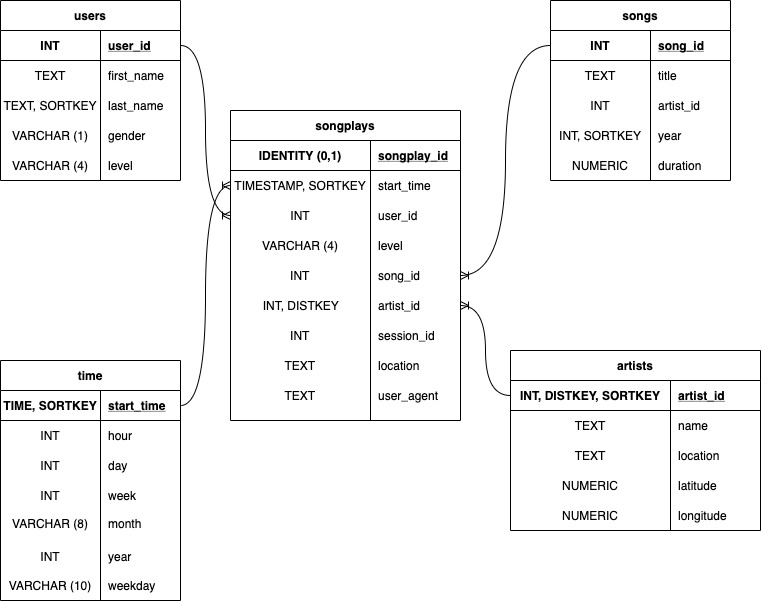

# Project: Data Warehouse for Sparkify


## Purpose
The purpose of this project is to build an ETL pipeline that extracts Sparkify's data from S3, stages them in Redshift, and transforms data into a set of dimensional tables for their analytics team to continue finding insights in what songs their users are listening to.


## Database Schema and Design
As of today, Sparkify collects all their data and store them in [Amazon S3](https://s3.console.aws.amazon.com/s3/buckets/udacity-dend). There are 2 sets of data: [song data](https://s3.console.aws.amazon.com/s3/buckets/udacity-dend/song_data) and [log data](https://s3.console.aws.amazon.com/s3/buckets/udacity-dend/log_data).  The song data contains metadata about a song and artist of a song, e.g. artist name, song title, artist location, etc. Its files are partitioned by the first three letters of each song's track ID and it's stored in JSON format. The song data JSON file looks like the following:

```
    {
        "artist_id":"ARJNIUY12298900C91",
        "artist_latitude":null,
        "artist_location":"",
        "artist_longitude":null,
        "artist_name":"Adelitas Way",
        "duration":213.9424,
        "num_songs":1,
        "song_id":"SOBLFFE12AF72AA5BA",
        "title":"Scream",
        "year":2009
    }
```

Meanwhile, log data consists activity log files generated by music streaming app based on the songs in the dataset, e.g. user first name, user last name, artist name, song title, etc. Its files are partitioned by year and month and stored in JSON format. The log data JSON file looks like the following:

```
    {
        "artist":null,
        "auth":"Logged In",
        "firstName":"Walter",
        "gender":"M",
        "itemInSession":0,
        "lastName":"Frye",
        "length":null,
        "level":"free",
        "location":"San Francisco-Oakland-Hayward, CA",
        "method":"GET",
        "page":"Home",
        "registration":1540919166796.0,
        "sessionId":38,
        "song":null,
        "status":200,
        "ts":1541105830796,
        "userAgent":"\"Mozilla\/5.0 (Macintosh; Intel Mac OS X 10_9_4) AppleWebKit\/537.36 (KHTML, like Gecko) Chrome\/36.0.1985.143 Safari\/537.36\"",
        "userId":"39"
    }
    {
        ...
    }
```

To optimize the query on song play analysis, we will use copy these data to staging tables called "staging_events" and "staging_songs". Then we will extract, transform, and load these data to fact and dimension tables. This will also help us to simplify query and fast aggregation of the data. Below is how the fact and dimension tables will look like:




## Instructions
Before creating the cluster and all the tables, we will need to enter AWS secret key, password, and all cluster information in a config file (dwh.cfg). Then we will run "create_tables.py" to create the cluster and all the tables including staging tables. Once all tables are created, then we will run "etl.py" to copy song data and log data to staging tables and then transform them to fact and dimension tables.

When we are done with the tables and want to delete the cluster and IAM role, we can run "delete_cluster.py"


## Author
Budi Sulayman


## License
This project is licensed under [MIT](https://choosealicense.com/licenses/mit/)